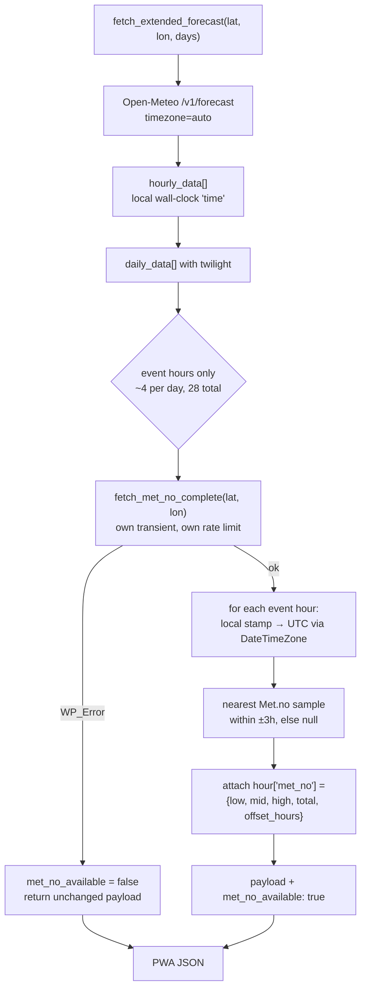

# Dual-source confidence for the PWA sunrise/sunset score

Design spec. Target: `cloud-cover-forecast` v1.2.0.

## Problem

The PWA scores a sunset with a single percentage and gives no indication of how
much that number should be trusted. A sunset scored 37% "Poor" turned out good.
Investigation showed the model read the sky correctly — the good sunset came
from a localised break to the west that no point forecast can see — but it
surfaced a real gap: the app presents one source's opinion as fact.

`fetch_extended_forecast()` (`includes/class-api.php:385`), the PWA's data path,
is single-source Open-Meteo. The Met.no merge lives in `fetch_weather_data()`
(`:308`) and serves only the shortcode and Gutenberg blocks. `README.md`
advertises dual-source weather data as a headline feature; it never reaches the
PWA.

### How much the sources actually disagree

Probe across 20 Irish locations, 101 sunrise/sunset hours:

| layer | mean diff | median | >25 pts | >50 pts |
|-------|-----------|--------|---------|---------|
| low   | 29.7 pts  | 20.7   | 47%     | 24%     |
| mid   | 19.5 pts  | 7.7    | 29%     | 13%     |
| high  | 26.9 pts  | 16.4   | 37%     | 21%     |

The band label differs in **43% of cases**. The bias is systematic rather than
noise: Open-Meteo reads low cloud 16 points cloudier than Met.no (mean 69.9 vs
53.4), mid 8 points cloudier, high effectively identical.

Low cloud is the gate in `scoreLightHour()`, so the PWA is systematically
pessimistic by construction.

Neither source is known to be the more accurate. That is the argument for
showing the disagreement rather than silently merging it away.

### Why the existing merge cannot be reused

`merge_cloud_cover_rows()` (`:1449`) overwrites row values with
`max($open_val, $met_val)` (`:1508`). It is pessimistic by design. Wiring it
into the PWA unchanged would have picked Open-Meteo's 40% low cloud again and
changed nothing, and it would destroy the Open-Meteo values a range needs.

## Correction, 2026-09-01: the layers are not comparable

The probe above compared `cloud_low` against `cloud_area_fraction_low` as
though they were the same measurement. They are not, and this invalidates the
original design.

| Layer | Open-Meteo | Met.no |
|-------|-----------|--------|
| low   | 0-3 km    | 0-2 km |
| mid   | 3-8 km    | 2-5 km |
| high  | above 8 km | above 5 km |

Open-Meteo's low band includes the 2-3 km deck that Met.no files under medium,
so it must read higher for definitional reasons alone. Across 20 Irish
locations at sunset it read higher in **18 of 20**. `scoreLightHour()` gates on
`cloud_low` and was tuned against Open-Meteo's definition, so substituting
Met.no's number does not measure a second opinion -- it measures a narrower
question, and reads optimistic every time.

High cloud survives the same test. Met.no's band is a strict superset of
Open-Meteo's, so Met.no should read *higher*; it read higher in 2 and lower in
15. Band geometry cannot produce that, so the high-cloud disagreement is real,
and the band difference biases Met.no upward, meaning the true disagreement is
at least as large as measured.

Decisive supporting evidence: the two sources agree on **total** cloud to 10.1
points mean absolute difference, while differing by 51.9 on low and 46.9 on
high. They agree about how much cloud there is and disagree about where it is.

**Revised decision 6a: only Met.no's high cloud feeds the second score.** Low
and mid stay Open-Meteo's. The "Cloud by source" table labels each figure with
the band it covers and carries a note saying only the high row is compared.

### Consequence: the range is usually narrow

Rescoring the same 20 locations with the corrected comparison:

| | before (unsound) | after |
|---|---|---|
| mean range width | 18.5 | 1.1 |
| median | 20 | 0 |
| max | 35 | 8 |
| band differs across range | 40% | 0% |

Two things suppress it, both properties of `scoreLightHour()` rather than of
the comparison:

1. `clarity = max(0, 1 - cloudLow / HORIZON_BLOCKED_AT)` with
   `HORIZON_BLOCKED_AT = 70`. At 70% low cloud or more the canvas term is
   multiplied by zero and high cloud cannot move the score at all. On an
   overcast night the range is always a point.
2. `HIGH_CLOUD_CURVE` is flat at 30 between 40% and 70% high cloud, so even a
   50-point cirrus disagreement often moves the score under 10 points.

This is the honest width. The wide ranges the first implementation produced
were mostly a unit mismatch.

## Goal

Make the score honest about forecast uncertainty by scoring both sources and
showing the span between them, without adding new vocabulary the reader has to
learn.

## Non-goals

- Deciding which source is right. The app does not adjudicate.
- Changing band thresholds (80/60/40). Deferred; see Deferred work.
- Changing the scoring formula, including `HORIZON_BLOCKED_AT`. Separate work.
- Bringing ranges to the Hours grid. It stays a single-source data table.

## Design decisions

1. **The score becomes a range.** Low and high from the two sources. When they
   agree it collapses to a single number, so the width *is* the confidence
   signal — no badge, no new vocabulary.
2. **Days 3–7 use the nearest 6-hourly Met.no reading**, up to 3h away, so the
   whole 7-day Outlook is covered. Measured cost: a 3h offset inflates apparent
   disagreement by ~5 points (30.9 → 35.6 over 520 samples) against 23.6 points
   of Met.no-vs-itself weather change alone. Errors add in quadrature, so offset
   comparison still predominantly measures source disagreement.
3. **The ring fills solidly to the low score and continues as a faded arc to the
   high score.** Arc length always starts at 0, so a tight-but-high range
   (82–91) still draws a nearly-full ring. Fullness never lies. Agreement
   renders exactly as today.
4. **The band word and card colour follow the low score.** The word always
   describes the number the solid arc draws; word and graphic never contradict.
   The upside is carried entirely by the faded tail.
5. **Single-source draws a dashed ring track**, plus one notice above the grid
   when the whole fetch is single-source. One mechanism covers both a global
   Met.no outage and a per-card gap.
6. **The second source reaches the sunrise/sunset score and a day-view
   comparison panel only.** The Hours grid is untouched.

### Consequence to be explicit about

Open-Meteo reads low cloud ~16 points cloudier on average and low cloud is the
gate, so the low end of almost every range will be the Open-Meteo score — the
same number shown today. Combined with decision 4, the band word and card
colour barely move. The faded tail is the only thing that changes.

This feature does not, on its own, make the app read less gloomy. It makes the
app honest, and it starts recording the per-source data that calibration needs.

## Architecture



### PHP — `includes/class-api.php`

New private method:

```php
private function attach_met_no_readings(
    array $hourly, array $daily, string $timezone, float $lat, float $lon
): array
```

It returns `array( $hourly, $met_no_available )`. It does **not** call
`merge_cloud_cover_rows()` and does not mutate any Open-Meteo value.

**The hour-key trap.** `fetch_met_no_complete()` (`:1070`) keys its map by
`gmdate( 'Y-m-d H', $timestamp )` — real UTC. `fetch_extended_forecast()` calls
Open-Meteo with `timezone=auto`, so `$hourly['time'][$i]` is an offset-less
local wall-clock stamp (`2026-09-01T20:00`). Matching them naively is the same
class of defect as the timezone bug fixed in v1.1.1.

Conversion must be:

```php
$dt = new DateTimeImmutable( $local_stamp, new DateTimeZone( $timezone ) );
$utc_ts = $dt->getTimestamp();
```

DST-correct by construction, unlike arithmetic on a fixed offset.

`merge_cloud_cover_rows()` gets away with `gmdate( 'Y-m-d H', $row['ts'] )`
because that path carries a true UTC `ts`. The extended path has no `ts` at all.

**Which hours get a reading.** The hours around each event, not all 168.
`sunriseSunsetRange` reads `[eventIndex, eventIndex + 1]` for each of sunrise
and sunset. PHP attaches to `eventIndex - 1 .. eventIndex + 2` — one hour of
slack on each side — so 8 hours per day, ~56 over 7 days, ~280 numbers rather
than 168 × 4.

PHP locates `eventIndex` by mirroring `findHourIndex`: a string prefix match of
`{$date}T{$HH}` against `$hour['time']`, where `$HH` is the first two
characters of `$day['twilight'][$event]`. That is a string operation on the same
local wall-clock stamps in both languages, with no arithmetic and no rounding,
so the two implementations cannot drift on a given input.

**This is nonetheless a cross-language coupling and must be named as one.** PHP
decides which hours carry a reading; JS decides which hours it reads. They agree
today. If the JS sampling window is ever widened — to three hours, or to a
window around civil twilight — PHP will not follow, and the extra hours will
silently have no `met_no` key, which JS reads as single-source (rule 2). The
failure is quiet degradation to today's behaviour rather than an exception, so
it will not announce itself.

Mitigations, both required:

- The ±1 hour of slack absorbs a small change without a PHP edit.
- A comment at each site pointing at the other, and a test asserting that every
  hour `sunriseSunsetRange` samples is an hour `attach_met_no_readings()`
  populates, so a widened window fails the suite rather than degrading silently.

**Nearest-sample selection.** Met.no's map is keyed by exact UTC hour, so a
±3h lookup scans candidate keys rather than hitting one. Each entry carries
`ts`, so selection is by smallest `abs( $entry_ts - $utc_ts )`. Ties resolve to
the earlier sample. Beyond 3h, no reading is attached.

**Independence.** Met.no keeps its own transient and its own rate-limit bucket,
so a Met.no outage never invalidates a good Open-Meteo forecast, and the
stale-while-revalidate grace applies to each separately.

**Payload additions** (all additive):

```php
$hour['met_no'] = array(
    'total'        => 91,
    'low'          => 8,
    'mid'          => 70,
    'high'         => 61,
    'offset_hours' => 0,   // absolute whole hours, 0..3, either direction
);
// top level:
'met_no_available' => true,
```

`met_no_available` is top-level so the global notice needs no per-card scan.

### JavaScript — `assets/js/forecast-scoring.js`

`sunriseSunsetScore` is renamed `sunriseSunsetRange` and returns an object.
It has two call sites (`forecast-app.js:1078`, `:1207`); a clean break is
preferred to a compatibility shim.

```js
// null when there is no event, as today. Otherwise:
{ low: 37, high: 75, sources: 2 }   // sources: 1 means single-source, high === low
```

The second score comes from overlaying Met.no's three cloud layers onto the
Open-Meteo hour and running the identical formula:

```js
const metHour = Object.assign({}, hour, {
  cloud_low:  met.low  ?? hour.cloud_low,
  cloud_mid:  met.mid  ?? hour.cloud_mid,
  cloud_high: met.high ?? hour.cloud_high,
});
scoreLightHour(metHour, isGlowHour);
```

Visibility and rain chance stay Open-Meteo's in both variants. Only cloud was
captured from Met.no, and holding everything else constant means the range
measures cloud disagreement and nothing else. A range that also moved with
visibility would be uninterpretable.

Three rules:

1. **Averaging is per source, not per hour.** Each source gets its own mean
   across the two sampled hours; the range is min/max of those two means.
   Taking min/max hour-by-hour and averaging afterwards mixes sources and
   invents a range wider than either source supports.
2. **A range requires Met.no data for every sampled hour.** If the event hour
   matches and the glow hour does not, the card is single-source. Partial
   coverage would compare a 2-hour mean against a 1-hour mean, which is not a
   comparison.
3. **The band rule lives in one function.** New export `bandScore(range)`
   returns `range.low`. `renderOutlookCard` and `renderDayHero` both call it
   before `getScoreClass` / `getScoreLabel`, so testing a different labelling
   rule later is a one-line change.

`getScoreClass`, `getScoreLabel`, `calculatePhotoScore` and `scoreLightHour`
keep taking a plain number and are otherwise unchanged.

`calculateWindowScore` is imported at `forecast-app.js:41` and never called —
dead since the view rewrite. Remove the import.

### Rendering — `assets/js/forecast-app.js`, `assets/css/forecast-app.css`

**Outlook card ring** (`renderScoreRing`). Three concentric circles, drawn
track → tail → value so the solid arc paints last:

```html
<circle class="score-ring-track" ... />                    <!-- dashed when sources === 1 -->
<circle class="score-ring-tail"  stroke-dasharray="${high - low} 100"
                                 stroke-dashoffset="-${low}" />  <!-- omitted when high === low -->
<circle class="score-ring-value" stroke-dasharray="${low} 100" />
<text class="score-ring-text">${high > low ? `${low}–${high}` : `${low}%`}</text>
```

CSS: four band rules for `.score-ring-tail` mirroring the existing
`.score-ring-value` rules (`forecast-app.css:1838-1841`) plus
`stroke-opacity: .35`; `stroke-dasharray: 2 2` on `.is-single-source
.score-ring-track`. Text drops from 9px to 8px when it holds a range — `37–75`
is five glyphs where the widest current string, `100%`, is four, against an
inner diameter of ~28.8 units in the 36-unit viewBox.

**Day hero** (`renderDayHero`) uses a horizontal meter, not a ring
(`.day-hero-meter-fill`, `width: ${score}%`). A second fill layer at 35%
opacity spans `low`→`high` behind the solid fill. The same "solid to low,
translucent to high" idea in the idiom that view already uses, so the two views
stay consistent without a second visual language.

**Day view "Cloud by source" panel**, between the hero and the phase list,
rendered whenever the event hour carries `met_no`:

| | Open-Meteo | Met.no |
|---|---|---|
| Low cloud | 40% | 8% |
| Mid cloud | 91% | 70% |
| High cloud | 59% | 61% |

Heading is "Cloud by source", not "Sources disagree" — the latter is wrong on
days they agree, and seeing both sources agree at 8% low is itself useful
before loading the car.

**Global notice.** When `met_no_available` is false, one line above the Outlook
grid: "Second forecast source unavailable."

### Accessibility

`renderScoreRing` output is `aria-hidden`; the card button carries the meaning.
The dashed track is a 46px visual cue a screen reader never sees, so agreement
and single-source must differ in words too:

- range: `Sunset Monday 20:31, Poor, 37 to 75 percent, two sources`
- agreement: `Sunset Monday 20:31, Poor, 37 percent, two sources`
- single: `Sunset Monday 20:31, Poor, 37 percent, one source`

### New i18n strings — `templates/pwa-app.php`

`cloudBySource`, `sourceOpenMeteo`, `sourceMetNo`, `secondSourceUnavailable`,
`oneSource`, `twoSources`, `scoreRange` (a `%1$s to %2$s percent` pattern; the
join is not an en-dash in every language).

## Failure modes

| Condition | Behaviour |
|---|---|
| Met.no request fails or is rate-limited | `met_no_available: false`, every card single-source, one notice above the grid |
| Met.no returns data, no sample within 3h of an event hour | that card single-source, no notice |
| Met.no has one of the two sampled hours only | that card single-source (rule 2) |
| A layer is null in Met.no | fall back to Open-Meteo for that layer only |
| Cached payload predates this version | no `met_no` keys, no `met_no_available`; renders exactly as today, single-source |

The last row is why every payload change is additive-only and why
`CLOUD_COVER_FORECAST_VERSION` must be bumped: a 12-hour stale-while-revalidate
grace means old-shape payloads are served after deploy and must not throw.

## Testing

The suite is `tests/run.sh` — node and php, no dependencies, 111 assertions.
It checks markup and logic and never renders CSS, so the ring and meter changes
still need a browser check.

**PHP** — `tests/dual-source.test.php`:

- local wall-clock stamp → UTC across a DST boundary
- nearest-sample selection at exactly 3h, at 3h1m (rejected), and equidistant
  (earlier wins)
- null-layer fallback to Open-Meteo, per layer
- Met.no `WP_Error` leaves the Open-Meteo payload byte-identical
- every hour `sunriseSunsetRange` samples is an hour `attach_met_no_readings()`
  populates, so widening the JS window without widening the PHP one fails here
  rather than degrading to single-source in silence

**JavaScript** — `tests/range.test.js`:

- per-source averaging, using a fixture where per-hour min/max gives a
  different and wider answer, so the test distinguishes the two implementations
- partial Met.no coverage yields `sources: 1`
- `high === low` renders no tail element and a `%` suffix
- dashed track present only when `sources === 1`
- aria strings for all three states

**Negative controls** for the two defects that matter: reintroduce naive
`gmdate` matching and the DST test must fail; reintroduce per-hour min/max and
the averaging test must fail. A test that passes with the bug present is not a
test — `tests/README.md` records two prior instances of exactly this.

`run.sh` already runs the JS tests under `TZ=UTC` and `TZ=Pacific/Auckland`;
new JS tests inherit that.

**Manual, in a browser** — the suite renders no CSS:

- a card with a range, a card where sources agree, a card that is single-source
- the same three in dark mode and in light mode
- the global notice with Met.no unreachable
- the day hero meter and the "Cloud by source" panel

## Deferred work

- **Band thresholds.** 80/60/40 stay. Alpenglow implies Good starts near 50 and
  Fair reaches down to ~27, but that inference rests on one evening and one
  number from a closed-source app. The day-view panel starts recording what each
  source read at every sunset actually shot, which is the calibration data that
  does not yet exist. Revisit with it.
- **The double penalty on low cloud.** `scoreLightHour` penalises low cloud
  twice: as a gate (`clarity = 1 - cloudLow / HORIZON_BLOCKED_AT`, with
  `HORIZON_BLOCKED_AT = 70`) and subtractively (`score -= cloudLow * 0.15`).
  Open-Meteo is the cloudier source on exactly that layer. Defensible to change,
  but it is separate work with its own calibration problem, and doing it in this
  branch would confound both changes.
- **Sampling toward the sunset azimuth.** A second Open-Meteo point 50–100 km
  west would capture the horizon-gap variable that made the 37% sunset good.
  This spec does not address it; no point forecast at the observer's location
  can.

## Constraints

- Met.no requires an identifying User-Agent; `get_met_no_user_agent()` (`:1124`)
  exists and already supplies one. Note that it includes
  `get_bloginfo( 'admin_email' )`, so the site admin's address is sent to Met.no
  on every call. Met.no's terms require a contact address, so this is legitimate
  and unchanged by this work, but it should be a known fact rather than a
  discovery.
- Rate limits are per-service and generous: Open-Meteo ~2,800/hour, Met.no
  20/sec. One extra Met.no call per forecast fetch is immaterial.
- Asset URLs carry `?v=CLOUD_COVER_FORECAST_VERSION`; the constant must be
  bumped or browsers serve stale JS and CSS.
- Per `CLAUDE.md`: update `reference.md` with new files, changed relationships
  and new constants, and add a changelog entry.
